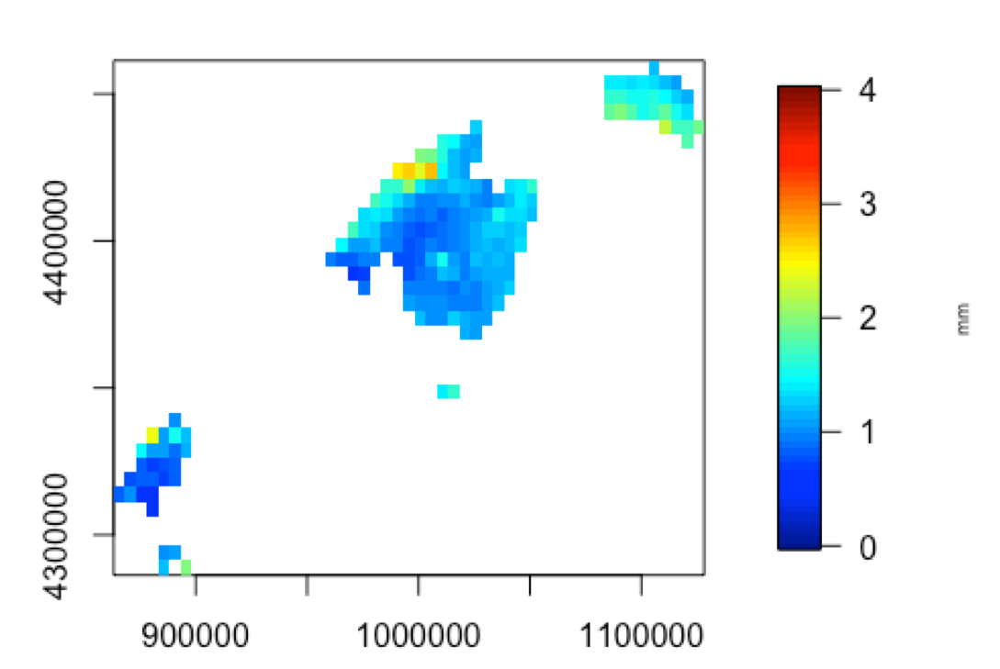
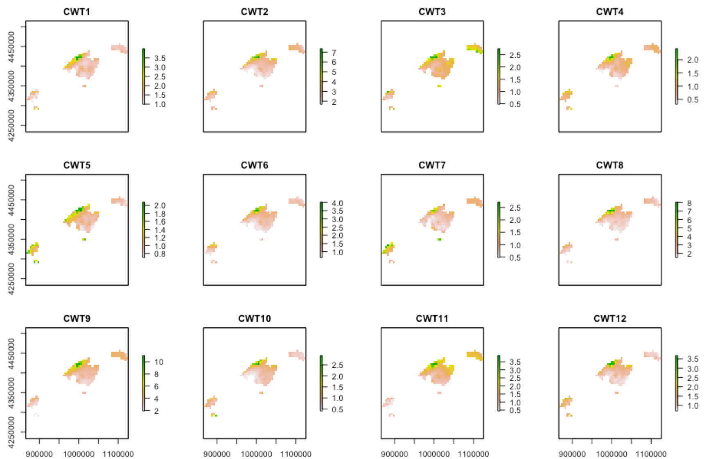

synoptReg
=========================================================

Overview
--------

**synoptReg** is an open source package for computing synoptic climate classifications and spatial regionalizations of environmental data.

Installation
------------

``` r
# To install the latest version from Github:
# install.packages("devtools")
devtools::install_github("lemuscanovas/synoptReg")
```

Functions
---------

synoptReg has two functions related to read and format data:

-   `read_nc` reads a NetCDF file to extract the atmospheric or environmental variable, longitudes, latitudes and dates. A continuous NetCDF without date gaps is required.
-   `tidy_cuttime_nc` formats the 3D-array output from \code{read_nc} function to an S-mode dataframe (variables = grid points, observations = days). Optionally, you can set the time period between specific years and/or decide if you want work with the full year or only with 3 - month season.


synoptReg also has two functions to performe the PCA:

-   `pca_decision` abc.
-   `synoptclas` abc.
-    ...


Usage
-----

```r
library(synoptReg)

# First of all, you need a NetCDF containing an atmospheric variable.
# Use read_nc to read the data easily. The output is a list object as 
# we shall see below. 
data(mslp) #mean sea level pressure data (ERA-20C)

# Now we need to convert our mslp data into S-mode data frame:
mslp_smode <- tidy_cuttime_nc(datalist = mslp, only_convert = TRUE)

# Before to apply the synoptic classification we need some information
# about the number of PCA to select in the procedure. For this reason,
# we use pca_decision
info_pca_mslp <- pca_decision(smode_data = mslp_smode$smode_data)
```
A scree plot is represented to select the number of PCA to retain. We could decide 6 PCA in a quick inspection. We can spend more time analyzing the pca results looking at `info_clas$summary`


```r
# Once we have decided on the number of components, we will proceed 
# with the synoptic classification:
mslp_s_clas <- synoptclas(smode_data = mslp_smode$smode_data, ncomp =  6) 

# if you do a little research on the resulting object, you obtain
# some interesting stats about the classification procedure.
# But now, it's time to represent our synoptic classification
# So we will use plot_clas to do it!
plot_clas(mslp$lon, mslp$lat, grouped_data = mslp_s_clas$grouped_data, 
          cwt_number = 3, legend.lab = "hPa")
title("CWT 3")
```


As you see, the circulation weather type (CWT) 3 is displayed!

```r
# Now we would like to know how the precipitation is spatialy 
# distributed over the Balearic Islands (Spain) when the CWT 3
# occurs. To do it, we need to read our precp_grid data and 
# reformat with tidy_cuttime_nc.
data(precp_grid) 
precp_grid_s <- tidy_cuttime_nc(datalist = precp_grid, only_convert = TRUE)
```
**Important**: Note that mslp data and precp_grid data must share the same time series (2000-01-01 to 2009-12-31). It is very important!
```r
# Now, we use the function plot_env to show the spatial distribution
# of precipitation based on CWT 3:
plot_env(longitude = precp_grid$lon, latitude = precp_grid$lat, 
         cluster_data = mslp_s_clas$clas, grid_data = 
         precp_grid_s$smode_data, cwt_number = 3, option = 2, 
         divide_units = 10, legend.lab = "mm")
title(paste("CWT 3"))
```


**Important**: Warning: be careful with option = 2. You can decide between 1 and 2. It is referred to lon and lat structure in the NetCDF file. So, if 1 is wrong, try 2.
``` r
# Let's to establish a spatial regionalisation based on the 10 precipitation
# maps derived from the synoptic classification. To do it, we need to convert
# our data frame prec_grid_s to a raster stack object.
precp_stack <- cwt_env_raststack(longitude = precp_grid$lon, 
                                 latitude = precp_grid$lat, 
                                 cluster_data = mslp_s_clas$clas,
                                 grid_data = precp_grid_s$smode_data,
                                 option = 2)
# As we note before, be carefull with parameter option.
# Now, let's to inspect the raster stack! 
raster::plot(precp_stack/10) # data expressed in mm
```


``` r
# Good! But we are looking for a simplified version, in order to obtain a
# schematic regionalisation. So we apply a "raster_pca" over our raster stack
# In addition, if we work with larger areas, we can use aggregate and focal
# to make the posterior regions with "regionalisation" function more continuous.
pca_precp <- raster_pca(precp_stack)
```

Now, we observe the spatial patterns of the precipitaiton over the Balearic Islands.

``` r
# Nevertheless, we want a final map with the precipitation regions/regimes of our
# study area. You can use a for loop to find the ideal number of regions. In this
# case we have applied the regionalisation with 4 centers (regions).
precp_region <- regionalisation(pca_precp$rasterPCA, centers = 4)
raster::plot(precp_region$regionalisation, legend = F, 
             col = c("orange", "green4", "darkred","lightblue"))
```


## Any doubt?
Feel free to contact me: mlemus@ub.edu
