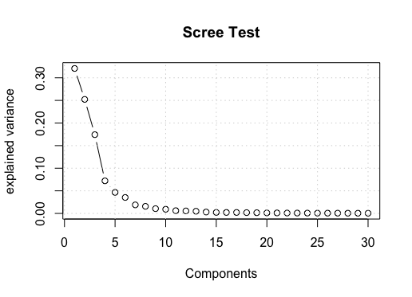
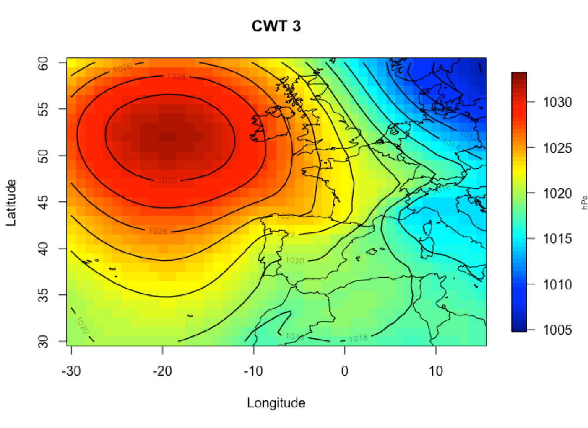

synoptReg
=========================================================

Overview
--------

**synoptReg** is an open source package fot computing synoptic climate classifications and spatial regionalizations of environmental data.

Installation
------------

``` r
# To install the latest version from Github:
# install.packages("devtools")
devtools::install_github("lemuscanovas/synoptReg")
```

Functions
---------

synoptReg has two functions related to read and format data:

-   `read_nc` reads a NetCDF file to extract the atmospheric or environmental variable, longitudes, latitudes and dates. A continuous NetCDF without date gaps is required.
-   `tidy_cuttime_nc` formats the 3D-array output from \code{read_nc} function to an S-mode dataframe (variables = grid points, observations = days). Optionally, you can set the time period between specific years and/or specify if you want work with the full year or only with 3 - month season.


synoptReg also has two functions to performe the PCA:

-   `pca_decision` abc.
-   `synoptclas` abc.


Usage
-----

```r
library(synoptReg)

# First of all, you need a NetCDF containing an atmospheric variable.
# Use read_nc to read the data easily. The output is a list object as 
# we shall see below. 
data(mslp)

# Now we need to convert our mslp data into S-mode data frame:
mslp_smode <- tidy_cuttime_nc(datalist = mslp, only_convert = TRUE)

# Before to apply the synoptic classification we need some information
# about the number of PCA to select in the procedure. For this reason,
# we use pca_decision
info_pca_mslp <- pca_decision(smode_data = mslp_s$smode_data)
```
A scree plot is represented to select the number of PCA to retain. We could decide 6 PCA in a quick inspection. We can spend more time analyzing the pca results looking at `info_clas$summary`


```r
# Once we have decided on the number of components, we will proceed 
# with the synoptic classification:
mslp_s_clas <- synoptclas(smode_data = mslp_s$smode_data, ncomp =  6) 

# if you do a little research on the resulting object, you obtain
# some interesting stats about the classification procedure.
# But now, it's time to represent our synoptic classification
# So we will use plot_clas to do it!
plot_clas(mslp$lon, mslp$lat, grouped_data = mslp_s_clas$grouped_data, cwt_number = 3, legend.lab = "hPa")
title(paste("CWT 3"))
```

As you see, the circulation weather type (CWT) 3 is displayed!

```r
# Now we would like to know how the precipitation is spatialy 
# distributed over the Balearic Islands (Spain) when the CWT 3
# occurs. To do it, we need to read our precp_grid data and 
# reformat with tidy_cuttime_nc.
elmat %>%
  sphere_shade(texture = "desert") %>%
  add_water(detect_water(elmat), color="desert") %>%
  plot_map()
```


``` r
#And we can add a raytraced layer from that sun direction as well:
elmat %>%
  sphere_shade(texture = "desert") %>%
  add_water(detect_water(elmat), color="desert") %>%
  add_shadow(ray_shade(elmat)) %>%
  plot_map()
```


``` r
elmat %>%
  sphere_shade( texture = "desert") %>%
  add_water(detect_water(elmat), color="desert") %>%
  add_shadow(ray_shade(elmat)) %>%
  add_shadow(ambient_shade(elmat)) %>%
  plot_map()
```


Rayshader also supports 3D mapping by passing a texture map (either external or one produced by rayshader) into the `plot_3d` function.

``` r
elmat %>%
  sphere_shade(texture = "desert") %>%
  add_water(detect_water(elmat), color="desert") %>%
  add_shadow(ray_shade(elmat)) %>%
  add_shadow(ambient_shade(elmat)) %>%
  plot_3d(elmat)
```


You can also easily add a water layer by setting `water = TRUE` (and setting `waterdepth` if the water level is not 0). You can customize the appearance and transparancy of the water layer via arguments to `plot_3d`. Here's an example using the built-in example bathymetric/topographic data of Monterey Bay, CA `montereybay` (zscale for a 1-to-1 ratio  using `montereybay` would be 200, but in plot_3d is set to 50 to give a 4x exaggerated height in the z-direction) :

``` r
montereybay %>% 
    sphere_shade(texture = "imhof1") %>% 
    add_shadow(ray_shade(montereybay,zscale=200)) %>%
    add_shadow(ambient_shade(montereybay,zscale=200)) %>%
    plot_3d(montereybay, water=TRUE, zscale=50, theta=-45,
            waterdepth = 0, wateralpha = 0.6, watercolor = "#88DDFF",
            waterlinecolor = "white", waterlinealpha = 0.5)
```


