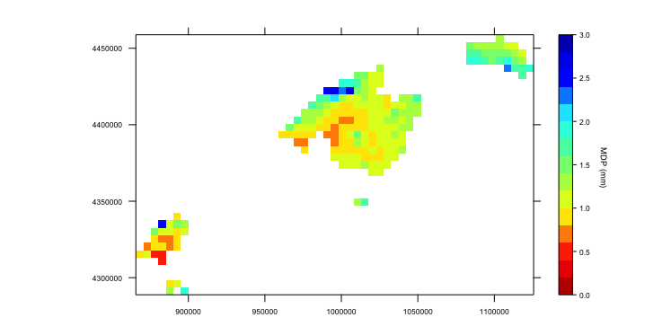

synoptReg
=========================================================


[](https://cran.r-project.org/package=synoptReg)
[](http://cran.rstudio.com/web/packages/synoptReg/index.html)
[](http://www.repostatus.org/#active)

Overview
--------

**synoptReg** is an open source package for computing synoptic climate classifications and spatial regionalizations of environmental data.

News!
------------
**Version 0.2.2 was updated to CRAN!** 

*new releases of version 0.2.2:*
- the `tidy_cuttime_nc` function has been rewritten. The `only_convert` argument has been removed, and the `initial_year` and `end_year` arguments have been replaced by `year_range`.

**Version 0.3.0 updated to GitHub:**
*new releases of version 0.3.0:*
- A new function called `download_ncep` was developed in order two download reanalysis data form NCEP/NCAR.
- We have added the argument `option` to `raster_clas` function in the same way as in the `raster_ct2env`

Installation
------------

 **Now also in CRAN!**

``` r
# To install the CRAN version (0.2.1):
install.packages("synoptReg")

# To install the latest version (0.2.1) from Github:
# install.packages("devtools")
devtools::install_github("lemuscanovas/synoptReg")
```

Functions
---------

synoptReg has two functions related to read and format data:

-   `read_nc` reads a NetCDF file to extract the atmospheric or environmental variable, longitudes, latitudes and dates. A continuous NetCDF without date gaps is required.
-   `tidy_cuttime_nc` formats the 3D-array output from \code{read_nc} function to an S-mode dataframe (variables = grid points, observations = days). Optionally, you can set the time period between specific years and/or decide if you want work with the full year or only with 3 - month season.


synoptReg also has two functions to perform the PCA approach to compute the synoptic classification:

-   `pca_decision` plots the explained variance against the number of the principal component. In addition, it returns all the information about the PCA performance.
-   `synoptclas` establishes a synoptic classification based on any atmospheric variable (i.e. mean sea level pressure, geoptential height at 500 hPa, etc).

There are two functions to rasterize the results in order to get a cool visualization of the aftermentioned synoptic classification:

-   `raster_clas` converts the dataframe of the synoptic classification data into a RasterStack format.
-   `raster_ct2env`  converts the dataframe of the environmental data based on the synoptic classification into a RasterStack object.

Finally, synoptReg provides three functions to convert our data to raster, perform a raster PCA and finally, execute an automatic spatial regionalisation (clustering):

-   `raster_pca` performs a PCA on a RasterStack object.
-   `regionalization` Performs an unspervised clustering of the RasterStack object.


Usage
-----

```r
library(synoptReg)

# First of all, you need a NetCDF containing an atmospheric variable.
# Use read_nc to read the data easily. The output is a list object as 
# we shall see below. 
data(mslp) #mean sea level pressure data (ERA-20C)

# Now we need to convert our mslp data into S-mode data frame:
mslp_smode <- tidy_cuttime_nc(datalist = mslp, only_convert = TRUE)

# Before to apply the synoptic classification we need some information
# about the number of PCA to select in the procedure. For this reason,
# we use pca_decision
info_pca_mslp <- pca_decision(smode_data = mslp_smode$smode_data)
```
A scree plot is represented to select the number of PCA to retain. We could decide 6 PCA in a quick inspection. We can spend more time analyzing the pca results looking at `info_clas$summary`


```r
# Once we have decided on the number of components, we will proceed 
# with the synoptic classification:
mslp_s_clas <- synoptclas(smode_data = mslp_smode$smode_data, ncomp =  6) 

# if you do a little research on the resulting object, you obtain
# some interesting stats about the classification procedure. For example,
# yearly or monthly temporal series can be obtained.
# But now, it's time to represent our synoptic classification.
# So we will use raster_clas to obtain the classification in a raster
# format. 
raster_ct <- raster_clas(mslp$lon, mslp$lat, mslp_s_clas$grouped_data)

# This raster stack can be plotted by ggplot, rasterVis or sp. In this case,
# the CT 3 is displayed:

library(sp)
library(maptools)
require(raster)

# Reading the world shapefile
limit <- readShapeSpatial("TM_WORLD_BORDERS_SIMPL-0.3.shp")

# selecting CWT3
ct3 <- raster_ct$CT3

# plotting CWT 3
spplot(ct3,
       sp.layout = list(limit, first = FALSE),
       names.attr=names(ct3),
       at = seq(round(min(minValue(ct3))-1),round(max(maxValue(ct3))+4), 2),
       zlim = c(min(minValue(ct3)),round(max(maxValue(ct3)))),
       col.regions=colorRamps::matlab.like2(100),
       par.settings = list(strip.background=list(col="white"), fontsize = list(text = 7)),
       contour=TRUE,
       colorkey = T,
       col='black',
       pretty=TRUE,
       scales=list(draw = TRUE),
       labels=TRUE) 
grid.text("MDP (mm)", x=unit(0.900,"npc"), y=unit(0.50, "npc"), rot = -90, gp=gpar(fontsize=7))

```


As you see, the synoptic classification is displayed!

```r
# Now we would like to know how the precipitation is spatialy 
# distributed over the Balearic Islands (Spain) when the CT 3
# occurs. To do it, we need to read our precp_grid data and 
# reformat with tidy_cuttime_nc.
data(precp_grid) 
precp_grid_s <- tidy_cuttime_nc(datalist = precp_grid, only_convert = TRUE)
```
**Important**: Note that mslp data and precp_grid data must share the same time series (2000-01-01 to 2009-12-31). It is very important!
```r
# Now, we use the function raster_cwt2env to get the precipitation raster
# based on CWT 3:
raster_env <- raster_ct2env(precp_grid$lon, precp_grid$lat, mslp_s_clas$clas, 
                            grid_data = precp_grid_s$smode_data, option = 2)
# And then, we can plot this raster:
raster_env3 <- raster_env$CT3

spplot(raster_env3/10,
       sp.layout = list(limit, first = FALSE),
       names.attr=names(raster_env3),
       at = seq(round(min(minValue(raster_env3/10))),round(max(maxValue(raster_env3))+0.5),0.2),
       # zlim = c(round(min(minValue(raster_env3))),round(max(maxValue(raster_env3)))),
       col.regions=rev(colorRamps::matlab.like2(100)),
       par.settings = list(strip.background=list(col="white"), fontsize = list(text = 8)),
       contour=FALSE,
       colorkey = TRUE,
       col='black',
       pretty=TRUE,
       scales=list(draw = TRUE),
       labels=TRUE)
grid.text("MDP (mm)", x=unit(0.900,"npc"), y=unit(0.50, "npc"), rot = -90, gp=gpar(fontsize=7))
```


**Important**: be careful with option = 2. You can decide between 1 and 2. It is referred to lon and lat structure in the NetCDF file. So, if 1 is wrong, try 2.
``` r
# Let's to establish a spatial regionalisation based on the 12 precipitation
# maps derived from the synoptic classification. In order to obtain a
# schematic regionalisation, we apply a "raster_pca" over our raster stack
# In addition, if we work with larger areas, we can use aggregate and focal
# to make the posterior regions with "regionalisation" function more continuous.
pca_precp <- raster_pca(raster_env)
```

Now, we observe the spatial patterns of the precipitaiton over the Balearic Islands.

``` r
# Nevertheless, we want a final map with the precipitation regions/regimes of our
# study area. You can use a for loop to find the ideal number of regions. In this
# case we have applied the regionalization with 4 centers (regions).
precp_region <- regionalization(pca_precp$rasterPCA, centers = 4)
raster::plot(precp_region$regionalization, legend = F, 
             col = c("orange", "green4", "darkred","lightblue"))
```


## Any doubt?
Feel free to contact me: mlemus@ub.edu
